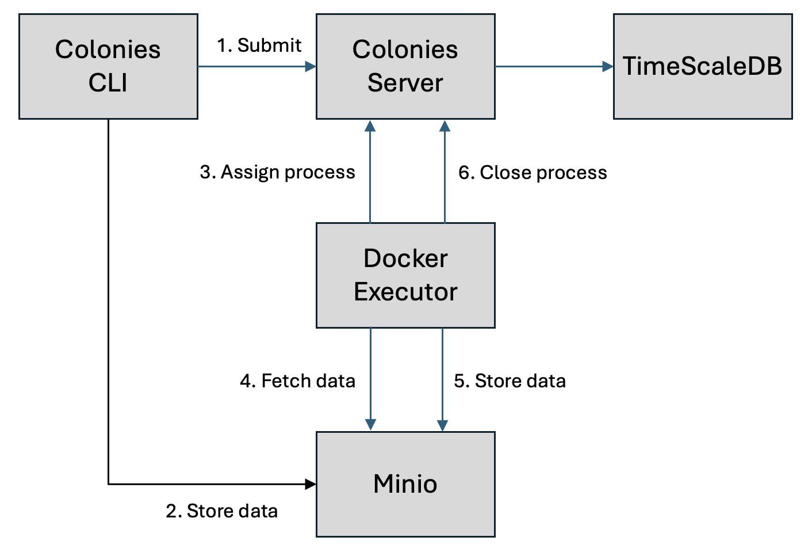

# Getting started
The picture below shows an overview of the components of ColonyOS. The Colonies server provides an API used by users or applications to run jobs (processes). Executors connect to the Colonies server to receive process assignments, execute the processes, and finally report the results back to the Colonies server. ColonyOS also provides data management functionality through a meta-filesystem called the Colony Filesystem (ColonyFS).

Unlike a traditional filesystem, ColonyFS doesn't store the actual files but instead stores metadata about the files. This metadata includes information such as file names, checksums, internet addresses of servers from which to fetch data, and details about the protocols used. In this tutorial, we will use Minio S3 as a backend to store data.

Executors are like microservices and are designed to interact with other platforms. In this tutorial, we are going to use container executors, which are a family of executors designed to run software containers. A *Docker Executor* is designed to run Docker containers. A *K8s Executor* runs processes as Kubernetes batch jobs. An *HPC Executor* runs processes as Singularity containers using Slurm. An executor can perform any kind of computation. In the [next tutorials](../3-python/tutorial.md), we will develop a custom executor in Python.



## Setting up a development environment
The following commands will use Docker Compose to set up and configure a Colonies server, a TimescaleDB, a Minio server, and a Docker Executor. To set up a production environment, it is recommended to use Kubernetes.

*Note!* The *docker-compose.env* file contains credentials and configuration and must be sourced before using the Colonies CLI command.

On Mac or Linux type:

```bash
wget https://raw.githubusercontent.com/colonyos/colonies/main/docker-compose.env; 
source docker-compose.env; 
wget https://raw.githubusercontent.com/colonyos/colonies/main/docker-compose.yml;
docker-compose up
```

On Windows type:
```bash
wget https://raw.githubusercontent.com/colonyos/colonies/main/windowsenv.bat 
windowsenv.bat
wget https://raw.githubusercontent.com/colonyos/colonies/main/docker-compose.yml
docker-compose up
```

Note that all three commands must be types seperately on Windows.

Press control-c to exit.

To remove all data, type:

```bash
docker-compose down --volumes
```

## Installing the Colonies CLI
The Colonies CLI can be downloaded [here](https://github.com/colonyos/colonies/releases). Linux, Window, and Apple is supported.

Copy the binary to directory availble in the *PATH* e.g. **/usr/local/bin**.

```bash
sudo cp colonies /use/local/bin
```

```bash
colonies --help
```

On MacOS there is an error first time you run it. You need to grant the Colonies CLI permission to execute. Open System Settings, go to Privacy & Security, and click on the *Allow* button next to *colonies* to enable it to execute.

Start another terminal and run the command below to load the credentials and settings, allowing the Colonies CLI to connect to the Colonies server started with Docker compose.

```bash
source docker-compose.env
```

On Window:
```bash
windowsenv.bat
```

We can now interact with the Colonies server, and for example, list available executors.

```bash
colonies executor ls
```

```console
╭────────────┬────────────────────┬──────────┬─────────────────────╮
│ NAME       │ TYPE               │ LOCATION │ LAST HEARD FROM     │
├────────────┼────────────────────┼──────────┼─────────────────────┤
│ dev-docker │ container-executor │ n/a      │ 2024-06-29 13:37:27 │
╰────────────┴────────────────────┴──────────┴─────────────────────╯
```

## Running a job
To run a process, we need to submit a so-called *meta-specification* to the Colonies server. The meta-specification will be wrapped into a *process* and then assigned to the Docker executor. The Docker executor will interpret the information in the meta-specification and start a Docker container that executes the command echo *hello world*.
executor.

The *cpu*, *mem*, and *gpu* parameters must be set but are not utilized by the Docker Executor. However, when using an HPC Executor or Kubernetes Executor, these parameters are crucial as they define the amount of resources to allocate for each process.

```json
{
    "conditions": {
        "executortype": "container-executor",
        "executornames": [
            "dev-docker"
        ],
        "nodes": 1,
        "processespernode": 1,
        "mem": "10Gi",
        "cpu": "1000m",
        "gpu": {
            "count": 0
        },
        "walltime": 60
    },
    "funcname": "execute",
    "kwargs": {
        "cmd": "echo hello world",
        "docker-image": "ubuntu:20.04"
    },
    "maxexectime": 55,
    "maxretries": 3
}
```

```bash
colonies function submit --spec echo.json --follow
```

```console
INFO[0000] Process submitted                             ProcessId=214682ea4bb59b7406caaae7018d6ecfc99d4b2e7d5c1a05656805d1796508d4
INFO[0000] Printing logs from process                    ProcessId=214682ea4bb59b7406caaae7018d6ecfc99d4b2e7d5c1a05656805d1796508d4
Pulling from library/ubuntu
Digest: sha256:0b897358ff6624825fb50d20ffb605ab0eaea77ced0adb8c6a4b756513dec6fc
Status: Image is up to date for ubuntu:20.04
hello world
INFO[0002] Process finished successfully                 ProcessId=214682ea4bb59b7406caaae7018d6ecfc99d4b2e7d5c1a05656805d1796508d4
```

Lets submit 20 processes:

```bash
sh -c 'for i in $(seq 1 20); do colonies function submit --spec echo.json ; done'
```

The Colonies server will queue the processes as the Docker Executor is configured to only run one process at a time. The command below shows all waiting processes.

```bash
colonies process psw
```

```console
╭──────────┬──────┬─────────────────────────┬─────────────────────┬───────────────┬────────────────────┬───────────┬───────╮
│ FUNCNAME │ ARGS │ KWARGS                  │ SUBMSSION TIME      │ EXECUTOR NAME │ EXECUTOR TYPE      │ INITIATOR │ LABEL │
├──────────┼──────┼─────────────────────────┼─────────────────────┼───────────────┼────────────────────┼───────────┼───────┤
│ execute  │      │ cmd:echo hello world... │ 2024-06-30 11:00:57 │ dev-docker    │ container-executor │ myuser    │       │
│ execute  │      │ cmd:echo hello world... │ 2024-06-30 11:00:57 │ dev-docker    │ container-executor │ myuser    │       │
│ execute  │      │ cmd:echo hello world... │ 2024-06-30 11:00:57 │ dev-docker    │ container-executor │ myuser    │       │
│ execute  │      │ cmd:echo hello world... │ 2024-06-30 11:00:57 │ dev-docker    │ container-executor │ myuser    │       │
│ execute  │      │ cmd:echo hello world... │ 2024-06-30 11:00:57 │ dev-docker    │ container-executor │ myuser    │       │
│ execute  │      │ cmd:echo hello world... │ 2024-06-30 11:00:57 │ dev-docker    │ container-executor │ myuser    │       │
│ execute  │      │ docker-image:ubuntu:... │ 2024-06-30 11:00:57 │ dev-docker    │ container-executor │ myuser    │       │
│ execute  │      │ cmd:echo hello world... │ 2024-06-30 11:00:57 │ dev-docker    │ container-executor │ myuser    │       │
│ execute  │      │ cmd:echo hello world... │ 2024-06-30 11:00:57 │ dev-docker    │ container-executor │ myuser    │       │
│ execute  │      │ cmd:echo hello world... │ 2024-06-30 11:00:57 │ dev-docker    │ container-executor │ myuser    │       │
│ execute  │      │ cmd:echo hello world... │ 2024-06-30 11:00:57 │ dev-docker    │ container-executor │ myuser    │       │
│ execute  │      │ docker-image:ubuntu:... │ 2024-06-30 11:00:57 │ dev-docker    │ container-executor │ myuser    │       │
│ execute  │      │ cmd:echo hello world... │ 2024-06-30 11:00:57 │ dev-docker    │ container-executor │ myuser    │       │
│ execute  │      │ cmd:echo hello world... │ 2024-06-30 11:00:57 │ dev-docker    │ container-executor │ myuser    │       │
│ execute  │      │ docker-image:ubuntu:... │ 2024-06-30 11:00:57 │ dev-docker    │ container-executor │ myuser    │       │
│ execute  │      │ cmd:echo hello world... │ 2024-06-30 11:00:57 │ dev-docker    │ container-executor │ myuser    │       │
│ execute  │      │ cmd:echo hello world... │ 2024-06-30 11:00:57 │ dev-docker    │ container-executor │ myuser    │       │
╰──────────┴──────┴─────────────────────────┴─────────────────────┴───────────────┴────────────────────┴───────────┴───────╯
```

To show the last 5 successful processes.
```bash
colonies process pss --count 5
```

```console
╭──────────┬──────┬─────────────────────────┬─────────────────────┬───────────────┬────────────────────┬───────────┬───────╮
│ FUNCNAME │ ARGS │ KWARGS                  │ SUBMSSION TIME      │ EXECUTOR NAME │ EXECUTOR TYPE      │ INITIATOR │ LABEL │
├──────────┼──────┼─────────────────────────┼─────────────────────┼───────────────┼────────────────────┼───────────┼───────┤
│ execute  │      │ docker-image:ubuntu:... │ 2024-06-30 11:11:12 │ dev-docker    │ container-executor │ myuser    │       │
│ execute  │      │ cmd:echo hello world... │ 2024-06-30 11:11:12 │ dev-docker    │ container-executor │ myuser    │       │
│ execute  │      │ cmd:echo hello world... │ 2024-06-30 11:11:12 │ dev-docker    │ container-executor │ myuser    │       │
│ execute  │      │ docker-image:ubuntu:... │ 2024-06-30 11:11:12 │ dev-docker    │ container-executor │ myuser    │       │
│ execute  │      │ cmd:echo hello world... │ 2024-06-30 11:11:12 │ dev-docker    │ container-executor │ myuser    │       │
╰──────────┴──────┴─────────────────────────┴─────────────────────┴───────────────┴────────────────────┴───────────┴───────╯
```

To show all failed processes:
```bash
colonies process psf
```

```console
INFO[0000] No failed processes found                     ColonyName=dev
```

And to show all running processes.
```bash
colonies process ps
```

```console
╭──────────┬──────┬─────────────────────────┬─────────────────────┬───────────────┬────────────────────┬───────────┬───────╮
│ FUNCNAME │ ARGS │ KWARGS                  │ START TIME          │ EXECUTOR NAME │ EXECUTOR TYPE      │ INITIATOR │ LABEL │
├──────────┼──────┼─────────────────────────┼─────────────────────┼───────────────┼────────────────────┼───────────┼───────┤
│ execute  │      │ cmd:echo hello world... │ 2024-06-30 11:11:15 │ dev-docker    │ container-executor │ myuser    │       │
╰──────────┴──────┴─────────────────────────┴─────────────────────┴───────────────┴────────────────────┴───────────┴───────╯
```

We can only run one process at a time since we only have one executor. Let's start another Docker Executor. We are going to use another Docker compose to launch the executor.

Start a new terminal and type:  
```bash
wget https://raw.githubusercontent.com/colonyos/executors/main/docker/docker-compose.yml -O docker-compose-executor.yml
source docker-compose.env; export COLONIES_EXECUTOR_NAME=dev-docker-2; export COLONIES_SERVER_HOST=$(hostname); export COLONIES_TLS=false
docker-compose -f docker-compose-executor.yml up
```

In another terminal type (remember to source docker-compose.env): 
```bash
colonies executor ls
```

```console
╭──────────────┬────────────────────┬──────────┬─────────────────────╮
│ NAME         │ TYPE               │ LOCATION │ LAST HEARD FROM     │
├──────────────┼────────────────────┼──────────┼─────────────────────┤
│ dev-docker   │ container-executor │ n/a      │ 2024-06-30 12:06:23 │
│ dev-docker-2 │ container-executor │ n/a      │ 2024-06-30 12:06:55 │
╰──────────────┴────────────────────┴──────────┴─────────────────────╯
```

Now, we have two executors and can run two processes at the same time. The Colonies server will load balance between the two executors.

## Logging 
The command below will search for logs containing the text "hello" in the last 30 days.

```bash
colonies log search --text "hello" -d 30
```

```console
INFO[0000] Searching for logs                            Count=20 Days=30 Text=hello
╭──────────────┬──────────────────────────────────────────────────────────────────╮
│ Timestamp    │ 2024-06-30 09:41:19                                              │
│ ExecutorName │ dev-docker                                                       │
│ ProcessID    │ 214682ea4bb59b7406caaae7018d6ecfc99d4b2e7d5c1a05656805d1796508d4 │
│ Text         │ hello world                                                      │
╰──────────────┴──────────────────────────────────────────────────────────────────╯
╭──────────────┬──────────────────────────────────────────────────────────────────╮
│ Timestamp    │ 2024-06-30 09:41:16                                              │
│ ExecutorName │ dev-docker                                                       │
│ ProcessID    │ 4d9bbcb7f9ad021a2e63b02bd3cfd4d4f9954a5d9f3ecaaee39b3087df0576bf │
│ Text         │ hello world                                                      │
╰──────────────┴──────────────────────────────────────────────────────────────────╯
╭──────────────┬──────────────────────────────────────────────────────────────────╮
│ Timestamp    │ 2024-06-30 09:41:13                                              │
│ ExecutorName │ dev-docker                                                       │
│ ProcessID    │ 1c7fc23e7d5ba4a2b044852e1c975eaabc3242be271f8b2661da9304701ac93b │
│ Text         │ hello world                                                      │
╰──────────────┴──────────────────────────────────────────────────────────────────╯
```

We can also get logs for a process:

```bash
colonies log get -p 1c494f2470d09e969ead451359f2e53e10e0d529b75ae2427cb3db4b05661fb1
```

```console
Pulling from library/ubuntu
Digest: sha256:0b897358ff6624825fb50d20ffb605ab0eaea77ced0adb8c6a4b756513dec6fc
Status: Image is up to date for ubuntu:20.04
hello world
```

## Get info about a process
```bash
colonies process get -p 1c7fc23e7d5ba4a2b044852e1c975eaabc3242be271f8b2661da9304701ac93b
```

```console
╭───────────────────────────────────────────────────────────────────────────────────────╮
│ Process                                                                               │
├────────────────────┬──────────────────────────────────────────────────────────────────┤
│ Id                 │ 1c7fc23e7d5ba4a2b044852e1c975eaabc3242be271f8b2661da9304701ac93b │
│ IsAssigned         │ True                                                             │
│ InitiatorID        │ 3fc05cf3df4b494e95d6a3d297a34f19938f7daa7422ab0d4f794454133341ac │
│ Initiator          │ myuser                                                           │
│ AssignedExecutorID │ fd2161d8d8c8fab014e9c1f7aea7a16645fc90b5b1de8830cc93bad0880eb38c │
│ AssignedExecutorID │ Successful                                                       │
│ PriorityTime       │ 1719733271698157723                                              │
│ SubmissionTime     │ 2024-06-30 09:41:11                                              │
│ StartTime          │ 2024-06-30 09:41:11                                              │
│ EndTime            │ 2024-06-30 09:41:11                                              │
│ WaitDeadline       │ 0001-01-01 00:53:28                                              │
│ ExecDeadline       │ 2024-06-30 09:42:06                                              │
│ WaitingTime        │ 13.974ms                                                         │
│ ProcessingTime     │ 1.501706s                                                        │
│ Retries            │ 0                                                                │
│ Input              │                                                                  │
│ Output             │                                                                  │
│ Errors             │                                                                  │
╰────────────────────┴──────────────────────────────────────────────────────────────────╯
╭───────────────────────────────────────────────────────────────╮
│ Function Specification                                        │
├─────────────┬─────────────────────────────────────────────────┤
│ Func        │ execute                                         │
│ Args        │ None                                            │
│ KwArgs      │ cmd:echo hello world docker-image:ubuntu:20.04  │
│ MaxWaitTime │ -1                                              │
│ MaxExecTime │ 55                                              │
│ MaxRetries  │ 3                                               │
│ Label       │                                                 │
╰─────────────┴─────────────────────────────────────────────────╯
╭───────────────────────────────────────╮
│ Conditions                            │
├──────────────────┬────────────────────┤
│ Colony           │ dev                │
│ ExecutorNames    │ dev-docker         │
│ ExecutorType     │ container-executor │
│ Dependencies     │                    │
│ Nodes            │ 1                  │
│ CPU              │ 1000m              │
│ Memory           │ 10240Mi            │
│ Processes        │ 0                  │
│ ProcessesPerNode │ 1                  │
│ Storage          │ 0Mi                │
│ Walltime         │ 60                 │
│ GPUName          │                    │
│ GPUs             │ 0                  │
│ GPUPerNode       │ 0                  │
│ GPUMemory        │ 0Mi                │
╰──────────────────┴────────────────────╯

No attributes found
```
