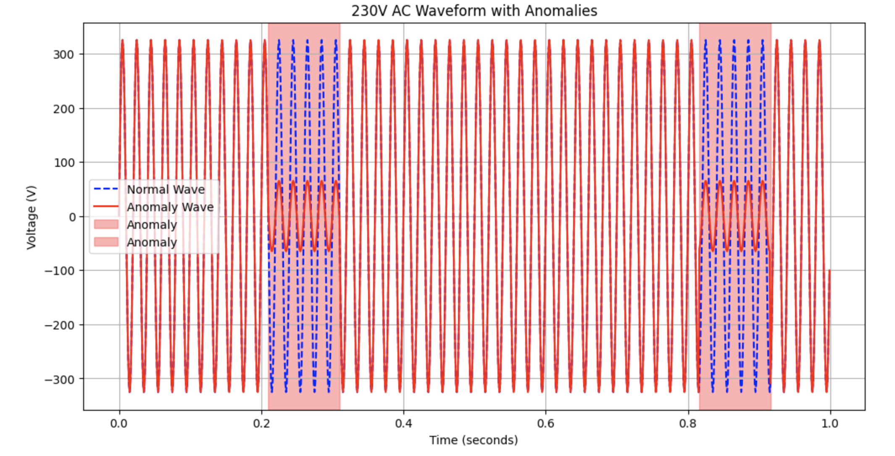
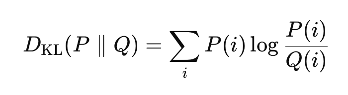
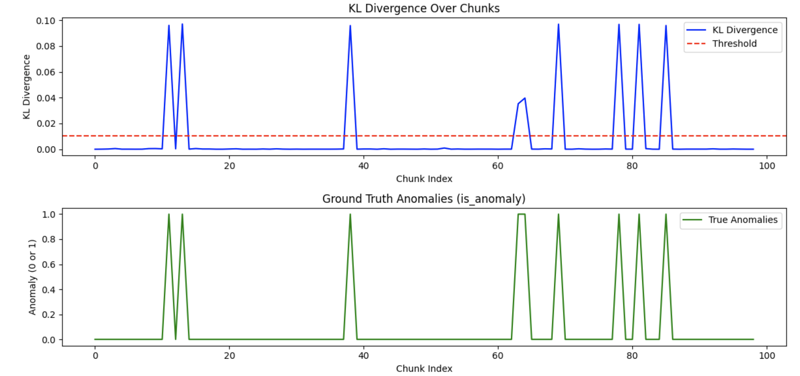
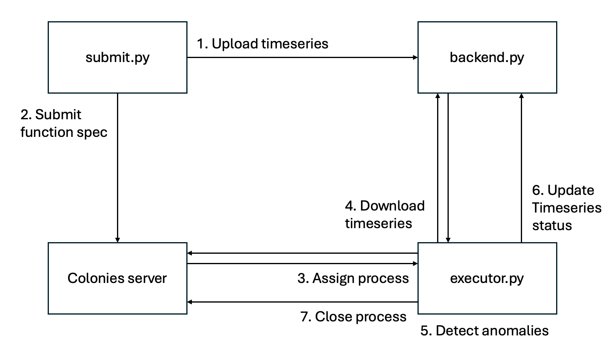

# Getting started
In this tutorial, we are going to develop a simple anomaly detection service that identifies irregularities in time-series data. Specifically, we will focus on detecting anomalies in a continuous signal, in particilar we are going to detect anomalies in voltage measurements.

# Dataset
To begin, we need to create a time-series dataset that simulates the behavior of a 50Hz AC power signal (230V). The dataset will consist of a continuous sinusoidal wave, representing the normal operation of the system, and occasional anomalies injected randomly to simulate sudden voltage drops.

We’ll start by writing a Python script to generate this synthetic dataset. The script will create a normal sinusoidal wave and inject anomalies based on a given probability and duration. 

Below is the explanation of the key parameters:

* **duration**: The total time in seconds for the dataset.
* **sampling_rate**: The number of samples collected per second.
* **frequency**: The frequency of the sinusoidal wave, which for a standard power signal is typically 50 Hz.
* **amplitude**: The peak amplitude of the signal in volts, which corresponds to the RMS value of the power supply (e.g., 230V).
* **anomaly_probability**: The probability of injecting an anomaly at any given point. A lower probability will result in fewer anomalies.
* **anomaly_duration**: The duration of the anomaly, in terms of the number of samples. This controls how long each anomaly lasts.
* **anomaly_drop**: The percentage drop in voltage during the anomaly (e.g., a value of 0.2 will simulate an 80% voltage drop).

The resulting dataset will contain three main columns:

* **time**: The time index for each sample.
* **normal_wave**: The sinusoidal wave time series representing normal operation.
* **anomaly_wave**: The wave time series with injected anomalies.
* **is_anomaly**: A label indicating if the sample contains an anomaly (1) or not (0).

Below is an example of the dataset:

| time  | normal_wave | abnormal_wave | is_anomaly |
|-------|-------------|---------------|------------|
| 0.001 | 325         | 325           | 0          |
| 0.002 | 324         | 324           | 0          |
| 0.003 | 322         | 258           | 1          |
| 0.004 | 319         | 255           | 1          |
| 0.005 | 315         | 315           | 0          |

In this table, the abnormal wave column shows the effect of an anomaly at time 0.003s and 0.004s, where the voltage dropped significantly. The corresponding entries in the anomaly label column are set to 1 to indicate the presence of an anomaly. Below is a picture showing 2 anomalies where the power has dropped.



To generate the dataset, run:
```bash
python gen_dataset.py
```

The script will create a file, called *dataset.csv*.

# Anomaly detection 
We are going to use a very simple method to detect anomalies based on **Kullback-Leibler (KL) divergence**. KL divergence measures how one probability distribution differs from a reference distribution, thus making useful to detect anomalies in time-series data.

In our case, we will treat the normal signal as our reference distribution and the potentially anomalous signal as the second distribution. By comparing these two distributions, we can 
calculate how much the abnormal signal deviates from what we expect under normal conditions.

## KL divergence
The KL divergence between two probability distributions *P* (the reference distribution) and *Q* (the observed distribution) is calculated as follows:



Where:
- *P(i)* is the probability of the signal in the normal distribution at bin *i*,
- *Q(i)* is the probability of the signal in the abnormal distribution at bin  *i*,
- *log P(i)/Q(i)* measures the divergence between the two distributions for each bin.

KL divergence essentially tells us how much information is lost when one distribution (the normal signal) is used to approximate another distribution (the abnormal signal). A higher KL divergence value means that the abnormal signal is significantly different from the normal one, and this difference could be indicative of an anomaly. By setting a threshold, we can define a boundary that distinguishes normal behavior from anomalous behavior. If the KL divergence value exceeds this threshold, it indicates that the difference between the normal and abnormal signals is significant enough to be considered an anomaly. 

Run the Python script below to calculate a suitable threshold value based on the training dataset.

```bash
python3 calc_kl_div_threshold.py
```



```bash
Anomaly detection threshold (KL Divergence): 0.010199148586751076
Accuracy: 1.0000
Precision: 1.0000
Recall: 1.0000
F1-Score: 1.0000
```

F1-Score of 1.0000 indicates perfect precision and recall, meaning the model did not make any classification errors at all. Hence, 0.010199148586751076 seems to be a good threshold.

The code below generates a sample and tests if it contains an anomaly. 

```python
import numpy as np
import pandas as pd
from scipy.stats import entropy

reference_wave_global = None

def generate_single_sample(duration=1, sampling_rate=1000, frequency=50, amplitude=230, 
                           anomaly_probability=0.0001, anomaly_duration=100, anomaly_drop=0.2):
    time = np.arange(0, duration, 1/sampling_rate)

    normal_wave = amplitude * np.sqrt(2) * np.sin(2 * np.pi * frequency * time)
    anomaly_wave = np.copy(normal_wave)
    labels = np.zeros_like(time, dtype=int)
    
    in_anomaly = False
    for i in range(len(time)):
        if np.random.rand() < anomaly_probability and not in_anomaly:
            end_index = min(i + anomaly_duration, len(time))
            anomaly_wave[i:end_index] = anomaly_wave[i:end_index] * anomaly_drop
            labels[i:end_index] = 1
            in_anomaly = True
        elif labels[i] == 0:
            in_anomaly = False
    
    data = {
        'time': time,
        'normal_wave': normal_wave,
        'anomaly_wave': anomaly_wave,
        'is_anomaly': labels
    }
    
    return pd.DataFrame(data)
    
def set_reference_wave(reference_wave):
    global reference_wave_global
    reference_wave_global = reference_wave

def compute_histogram(data, bins=50):
    hist, bin_edges = np.histogram(data, bins=bins, density=True)
    hist = hist + 1e-10  # Avoid division by zero
    return hist, bin_edges

def compute_kl_divergence(p, q):
    return entropy(p, q)

def detect_anomaly(sample_wave, kl_threshold=0.010199148586751076):
    global reference_wave_global
    
    if reference_wave_global is None:
        raise ValueError("Reference wave has not been set. Use 'set_reference_wave()' to set the reference.")

    sample_hist, _ = compute_histogram(sample_wave)
    reference_hist, _ = compute_histogram(reference_wave_global)
    kl_div = compute_kl_divergence(reference_hist, sample_hist)
    anomaly_detected = kl_div > kl_threshold
    
    return anomaly_detected, kl_div

sample_df = generate_single_sample(duration=1, sampling_rate=1000, frequency=50, amplitude=230, 
                                   anomaly_probability=0.001, anomaly_duration=100, anomaly_drop=0.2)

reference_wave = sample_df['normal_wave'].values
set_reference_wave(reference_wave)

sample_wave = sample_df['anomaly_wave'].values
anomaly_detected, kl_divergence = detect_anomaly(sample_wave)

print(f"Anomaly detected: {anomaly_detected}")
print(f"KL Divergence: {kl_divergence}")
```

```bash
python3 anomaly_detector_test.py  
```

```bash
Anomaly detected: True
KL Divergence: 0.22748609711977114
```

# Database backend
We will need a database system to store waveforms and track their anomaly status. As a first step, let's implement a simple in-memory database with a REST API for storing and managing waveforms.

```bash
pip install fastapi uvicorn panda requests
```

| HTTP Method | Endpoint                            | Description                                               |
|-------------|-------------------------------------|-----------------------------------------------------------|
| PUT         | /timeseries/{process_id}            | Create or update time-series data for a given process ID. |
| GET         | /timeseries/{process_id}            | Retrieve time-series data by process ID.                  |
| GET         | /timeseries/anomalies/              | Returns a list of all time-series.                        |
| PATCH       | /timeseries/{process_id}/anomaly    | Update only the anomaly status for a given process ID.    |
| DELETE      | /timeseries/{process_id}            | Delete time-series data by process ID.                    |

```bash
python3 backend.py
```

```bash
INFO:     Started server process [224389]
INFO:     Waiting for application startup.
INFO:     Application startup complete.
INFO:     Uvicorn running on http://0.0.0.0:8000 (Press CTRL+C to quit)
```

To test the backend, let's first develop a Python script that generates a waveform and upload it to the database. Start another terminal and type:

```bash
python3 upload_sample_test.py
```

```bash
Anomaly detected at index: 489
Sample waveform stored successfully.
```

To list all time series, type: 
```bash
curl -X 'GET' 'http://127.0.0.1:8000/timeseries/?anomalies_only=false'
```

```json
{"timeseries":[{"ts_id":"1234","process_id":null,"anomaly":false}]}⏎
```

Now, let's develop a Python script that fetches the process with ID 1234, checks if it contains an anomaly, and updates the database accordingly.

```bash
python3 anomaly_detector_backend_test.py
```

```bash
Anomaly detected! KL Divergence: 0.09482433169355574
Database updated successfully. Timeseries ID: 1234, Anomaly: True, Process ID: 5678
```

Let's check the database to see if the anomaly label has been updated.
```bash
curl -X 'GET' 'http://127.0.0.1:8000/timeseries/?anomalies_only=true'
```

```json
{"timeseries":[{"ts_id":"1234","process_id":"5678","anomaly":true}]}⏎
```

# ColonyOS
We are now going to explore several methods to build a scalable and resilient compute platform using ColonyOS.

* Anomaly Python executor
* Container executor
* Container executor with generators

Let's first explore how to build a Python executor.

## Anomaly Python executor
We are going to develop a custom anomaly detection executor in Python, which will receive process assignments from the Colonies server. These processes will contain metadata about time series that should be checked for anomalies. The main advantage of a custom executor is performance, as it directly runs Python code without the need to spawn containers. Spawning containers can sometimes be very slow, for example on large Kubernetes clusters. As a result, custom executors is particularly well-suited for stream processing use cases, where small jobs need to be processed quickly. However, scaling can be more complex, as additional executors must be deployed manually to handle higher workloads. 

Below is an overview of the system we are going to develop. The *submit.py* script generates a sample waveform time series, assign it unique ID, upload it to the database backend (*backend.py*), and submit a function specification to the *Colonies server*. The executor (*executor.py*) will then receive a process assignment, retrieve the time series ID from the function specification, fetch the time series from the database, detect anomalies, update the database, and finally close the process.



First let's start a database backend server.
```bash
python3 python3 backend.py
```

In another terminal, start the executor. Remeber to source the *docker-compose.env* file to load all credentials.
```bash
source docker-compose.env;
python3 python3 executor.py
```

### Submit time series anomaly detection jobs
Start yet another terminal to generate a time series to be checked for anomalies.

```bash
python3 submit.py 
```

```bash
-> Generating sample data
Anomaly detected at index: 787
-> Adding time series with ID: e67e0a21b1a19ab10395091b04354698312dfe2e89a6c331c4f86cc715126dcd to the database
Sample waveform stored successfully.
-> Submitting ColonyOS function spec
Process 330de7374daf974498ff86201fd8aea78f41731e06eb0c0bc621425a9b0ad19d submitted
```

If the time series contains anomalies, we should be able to list them by typing:

```bash
curl -X 'GET' 'http://127.0.0.1:8000/timeseries/?anomalies=true'
```

```json
{"timeseries":[{"ts_id":"e67e0a21b1a19ab10395091b04354698312dfe2e89a6c331c4f86cc715126dcd","process_id":"5678","anomaly":true}]}
```

Change the *anomalies* to false to list time series without anomalies.

```bash
curl -X 'GET' 'http://127.0.0.1:8000/timeseries/?anomalies=false'
```

Stop the executor by pressing ctrl-c, and then run the submit script a couple of times. Then type: 

```bash
colonies process psw
```

```bash
╭──────────┬─────────────────────────┬─────────────────────────┬─────────────────────┬───────────────┬──────────────────┬───────────┬───────╮
│ FUNCNAME │ ARGS                    │ KWARGS                  │ SUBMSSION TIME      │ EXECUTOR NAME │ EXECUTOR TYPE    │ INITIATOR │ LABEL │
├──────────┼─────────────────────────┼─────────────────────────┼─────────────────────┼───────────────┼──────────────────┼───────────┼───────┤
│ anomaly  │ 38df090c2882aafa7d06... │ db:http://127.0.0.1:... │ 2024-09-13 12:24:59 │               │ anomaly-executor │ johan     │       │
│ anomaly  │ 499ec3664748d66da558... │ db:http://127.0.0.1:... │ 2024-09-13 12:25:00 │               │ anomaly-executor │ johan     │       │
│ anomaly  │ 12c84c05d3b4ee8f1b78... │ db:http://127.0.0.1:... │ 2024-09-13 12:25:00 │               │ anomaly-executor │ johan     │       │
│ anomaly  │ cf9205cca7adf9b0a92f... │ db:http://127.0.0.1:... │ 2024-09-13 12:25:01 │               │ anomaly-executor │ johan     │       │
│ anomaly  │ 6bc65485c6b193a270aa... │ db:http://127.0.0.1:... │ 2024-09-13 12:25:01 │               │ anomaly-executor │ johan     │       │
│ anomaly  │ c76dc05cc12405fb276e... │ db:http://127.0.0.1:... │ 2024-09-13 12:25:02 │               │ anomaly-executor │ johan     │       │
╰──────────┴─────────────────────────┴─────────────────────────┴─────────────────────┴───────────────┴──────────────────┴───────────┴───────╯
```

If no anomaly detection executor is available, the processes will be queued until a matching executor becomes available. Once the executor is started again, it will begin processing all pending time series jobs. You can also start more than one executor, and the workload will be automatically load-balanced between the available executors.

### Checking logs
The executor code contains several *add_log* function calls, which upload logs to the Colonies server.

```python
logMsg = f"Checking anomalies in time series with ID: {ts_ids}"
self.colonies.add_log(process.processid, logMsg, self.executor_prvkey)
```

Let's search for the key word *Anom*.

```bash
colonies log search --text "Anom"             12:06:58
```

```bash
INFO[0000] Searching for logs                            Count=20 Days=1 Text=Anom
╭──────────────┬──────────────────────────────────────────────────────────────────╮
│ Timestamp    │ 2024-09-13 11:17:11                                              │
│ ExecutorName │ anomaly-executor                                                 │
│ ProcessID    │ 5e799b8ca37abbc5b79fa8a029f9395f37feb35ee6a44889d7d08cf9b43d7eec │
│ Text         │ Anomaly detected! KL Divergence: 0.20082905120266065, timeseries │
│              │ ID:                                                              │
│              │ 4c98f38a2b86e183d41a96728c8fb08867ea18c700a9de21545e0e03f48dffbc │
╰──────────────┴──────────────────────────────────────────────────────────────────╯
╭──────────────┬──────────────────────────────────────────────────────────────────╮
│ Timestamp    │ 2024-09-13 11:17:11                                              │
│ ExecutorName │ anomaly-executor                                                 │
│ ProcessID    │ 5e799b8ca37abbc5b79fa8a029f9395f37feb35ee6a44889d7d08cf9b43d7eec │
│ Text         │ Anomaly detected! KL Divergence: 0.20082905120266065, timeseries │
│              │ ID:                                                              │
│              │ 4c98f38a2b86e183d41a96728c8fb08867ea18c700a9de21545e0e03f48dffbc │
╰──────────────┴──────────────────────────────────────────────────────────────────╯
```

To retreive full logs for a specific process, type:

```bash
colonies log get -p 5e799b8ca37abbc5b79fa8a029f9395f37feb35ee6a44889d7d08cf9b43d7eec
```
