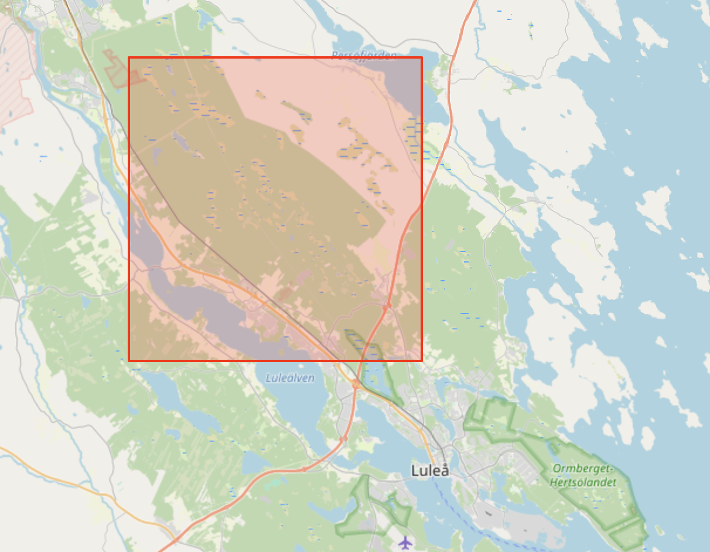
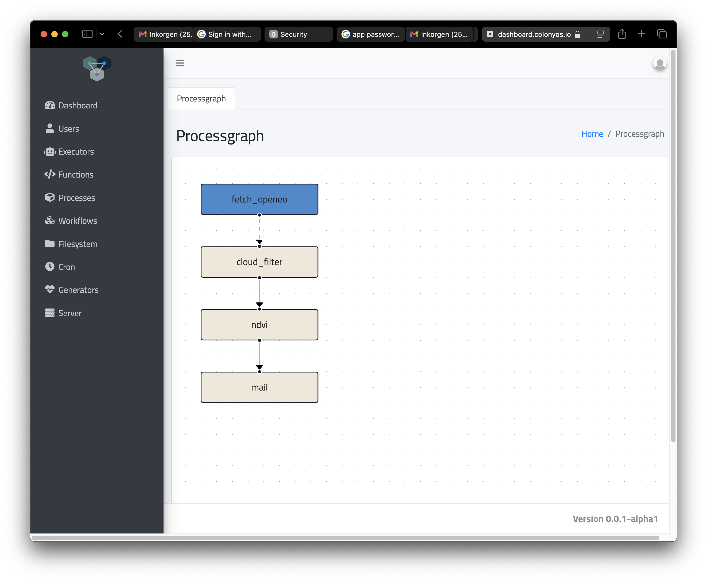
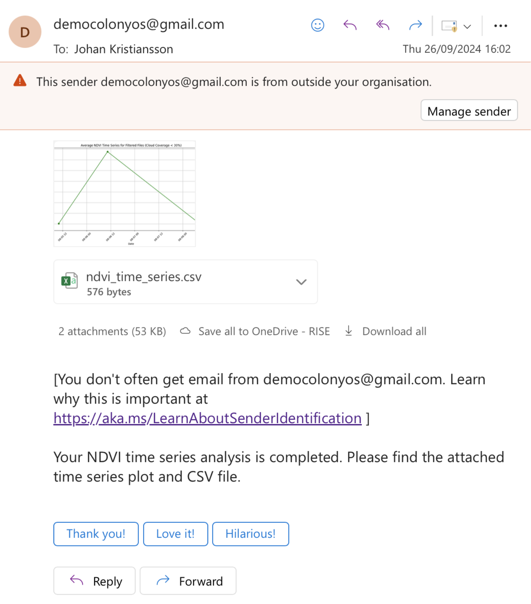

# Getting started
ColonyOS is a novel type of operating system or cloud platform, designed to operate across other platforms where underlying components can be distributed across a geographically dispersed **Compute Continuum**.

In this tutorial, we will explore how ColonyOS can be used for processing Earth Observation (EO) data. We are going to use a service called [OpenEO](https://openeo.org), which is a service part of the [Digital Earth Sweden](https://digitalearth.se) platform. By combining the capabilities of ColonyOS with the advanced features offered by OpenEO, we will demonstrate how to efficiently handle, analyze, and derive valuable insights from large-scale geospatial datasets.

# Use case
We will develop an EO workflow with the following steps:

1. Download Sentinel-2 images from Digital Earth Sweden's OpenEO service for a specified area of interest to the ColonyFS under **/openeo/rutvik/images**.

2. Generate cloud masks for all images in **/openeo/rutvik/images**, along with a CSV file (**cloud_coverage.csv**) containing cloud coverage percentages. Both the cloud masks and CSV file will be stored in the directory **/openeo/rutvik/cloud**.

3. Compute the NDVI average for all images in **/openeo/rutvik/images** where the cloud coverage (obtained from **/openeo/rutvik/cloud/cloud_coverage.csv**) exceeds a specified threshold. A time series plot (**ndvi_time_series.png**) and a corresponding CSV file (**ndvi_time_series.csv**) will be saved in **/openeo/rutvik/ndvi**.

4. Email the **ndvi_time_series.png** and **ndvi_time_series.csv** files to a selected user.

The selected area will be in northern Sweden, close to Luleå.



# Run the workflow
Type the following command to run the workflow:

```bash
colonies workflow submit --spec workflow.json
```

Note that the final step requires a valid Google SMTP account and will fail without one. We will explain how to create such an account later in this guide.  Additionally, ensure that executornames are updated to match an existing executor."



Once the workflow is complete, the selected user will receive an email containing the NDVI time series plot and a CSV file.



# Technical Explanation
## Deploying code  
In a traditional operating system, applications are typically stored on a filesystem, such as a hard drive. Similarly, in ColonyOS, applications like Python scripts are stored on a distributed filesystem called *ColonyFS* and are launched just as they would be in a conventional operating system.

The **src** directories contains the following Python Scripts:

| Filename         | Purpose                                    |
|------------------|--------------------------------------------|
| fetch.py         | Fetch images from OpenEO to ColonyFS       |
| cloud_filter.py  | Calculates cloud mask and coverage         |
| ndvi.py          | Calculates a NDVI time series              |
| mail.py          | Mails results to a user                    |
| parseenv.py      | Example script to explain argument passing |

```bash
colonies fs sync -l /openeo/src -d ./src --yes
```

We have now uploaded all scripts to ColonyFS under the label **/openeo/src**. A label functions similarly to a directory in a standard file system.

```bash
colonies fs label ls
```

```bash
╭────────────────────────────────────────┬───────╮
│ LABEL                                  │ FILES │
├────────────────────────────────────────┼───────┤
│ /openeo/src                            │ 5     │
╰────────────────────────────────────────┴───────╯
```

## Deploying code  
To run a script, we need to submit a function specification. The function specification defines which scripts we want to invoke. The function will be executed as a process by a remote executor that is part of the colony we are connected to. There are several options for passing arguments to the scripts. In this case, we will pass all arguments as environmental variables, which will be accessible to the scripts.

```json
{
    "conditions": {
      ...
    },
    "funcname": "execute",
    "kwargs": {
        "cmd": "python3",
        "docker-image": "johan/openeo",
		"args": [
            "/cfs/src/parseenv.py"
		]
    },
	"env": {
		"aoi": "{\"east\": 22.136334940987638, \"south\": 65.63560585326866, \"west\": 21.79257719972466, \"north\": 65.78212032521256}",
        "temporal_extent": "[\"2024-08-02T00:00:00Z\", \"2024-08-10T10:00:00Z\"]",
        "bands": "[\"b04\", \"b03\", \"b02\", \"b08\"]",
		"label": "/openeo/rutvik",
		"openeourl": "https://openeo.digitalearth.se",
		"openeouser": "testuser",
		"openeopasswd": "secretpassword"

	} 
    ...
}
```

To run the script, we must also define how the source code should be downloaded to the process, which runs as a container. The JSON code below instructs the executor to synchronize the label **/openeo/src** to the local filesystem /cfs/src, which will be accessible within the container where the process is running. This means that we can run the command: **python3 /cfs/src/parseenv.py**. 

```json
{
    ..., 
    "kwargs": {
        "cmd": "python3",
        "docker-image": "johan/openeo",
		"args": [
            "/cfs/src/parseenv.py"
		]
    },
    ...
	"fs": {
        "mount": "/cfs",
        "dirs": [
            {
                "label": "/openeo/src",
                "dir": "/src",
                "keepfiles": false,
                "onconflicts": {
                    "onstart": {
                        "keeplocal": false
                    },
                    "onclose": {
                        "keeplocal": false 
                    }
                }
            }
        ]
    },
...
}
```

This the source code of the **parsenv.py** script we just uploaded to ColonyFS.

```python
import os
import json

aoi_str = os.getenv("aoi")
aoi = json.loads(aoi_str)
temporal_extent = os.getenv("temporal_extent")
bands = os.getenv("bands")
label = os.getenv("label")
eo_service_url = os.getenv("openeourl")
user = os.getenv("openeouser")
passwd = os.getenv("openeopasswd")

print(aoi)
print(temporal_extent)
print(bands)
print(label)
print(eo_service_url)
print(user)
print(passwd)
```

Let's submit a function specification to run the script:

```bash
colonies function submit --spec env.json --follow
```

```bash
INFO[0000] Calculating sync plans
Analyzing /home/johan/dev/github/colony~ ... done!

INFO[0000] Synchronizing, nothing to do, already synchronized  Label=/openeo/src SyncDir=./src
INFO[0000] Process submitted                             ProcessId=25e4bc7f3e8c09e4c9cee166a1d24d33b5dd55595ca3a38ea2bc24edd9bc90a2
INFO[0000] Printing logs from process                    ProcessId=25e4bc7f3e8c09e4c9cee166a1d24d33b5dd55595ca3a38ea2bc24edd9bc90a2
Pulling from johan/openeo
Digest: sha256:e7bb4a99540adff96f5d2ee7362aaa094ab1f635558860ff7bdec07cbbfa2c42
Status: Image is up to date for johan/openeo:latest
{'east': 22.136334940987638, 'south': 65.63560585326866, 'west': 21.79257719972466, 'north': 65.78212032521256}
["2024-08-02T00:00:00Z", "2024-08-10T10:00:00Z"]
["b04", "b03", "b02", "b08"]
/openeo/rutvik
https://openeo.digitalearth.se
testuser
secretpassword
INFO[0003] Process finished successfully                 ProcessId=25e4bc7f3e8c09e4c9cee166a1d24d33b5dd55595ca3a38ea2bc24edd9bc90a2
```

It is also possible to define a local path on the system that should be uploaded to ColonyFS after the container has finished execution. We will use this feature to transfer data between processes in the workflow.

## Fethcing images from OpenEO 
The script [fetch.py](src/fetch.py) fetches data from OpenEO and store data in ColonyFS under **/openeo/rutvik/images**.

```bash
colonies function submit --spec fetch.json --follow
```

Let's see if some images were added to ColonyFS.

```bash
colony fs label ls
```

```bash
╭────────────────────────────────────────┬───────╮
│ LABEL                                  │ FILES │
├────────────────────────────────────────┼───────┤
│ /openeo/src                            │ 5     │
│ /openeo/rutvik/images                  │ 8     │
╰────────────────────────────────────────┴───────╯
```

To view the images we need to download them to our local filesystem.

```bash
colony fs sync -l /openeo/rutvik/images -d ./rutvik
```

Yikes, 


