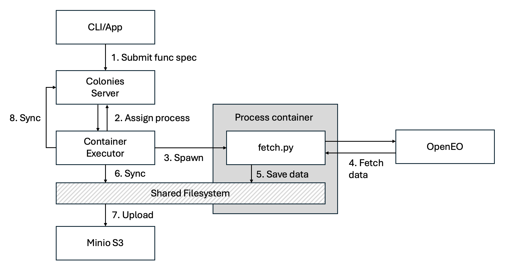

# Getting started
In this tutorial, we will explore how ColonyOS can be effectively be used for processing earth observation data. We are going to use a service called OpenEO, which is a service part of the Digital Earth Sweden platform. By combining the capabilities of ColonyOS with the advanced features offered by OpenEO, we will demonstrate how to efficiently handle, analyze, and derive valuable insights from large-scale geospatial datasets.

## Overview

