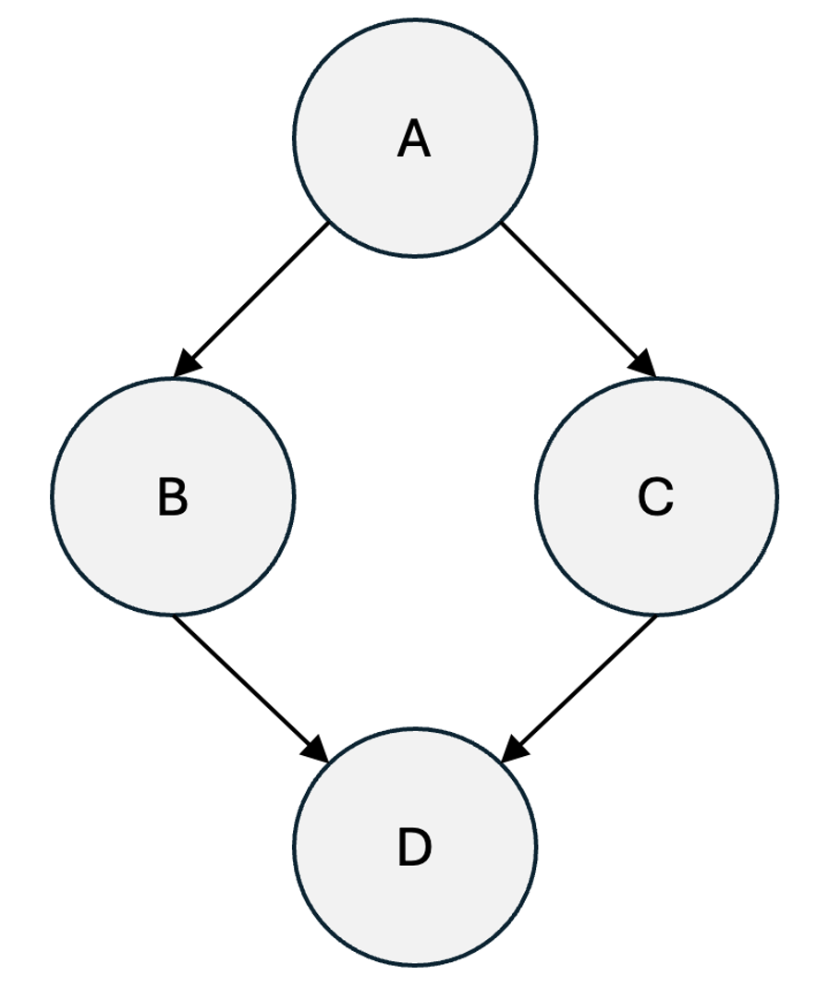

# Workflows
A workflow is a collection of function specifications, where some specifications may depend on others. When a workflow is submitted to the Colonies server, it creates the corresponding processes and adds them to the database queue. The server also establishes dependencies between the processes, forming a Directed Acyclic Graph (DAG).

The picture below illustrates an example of a DAG.



## Submitting a workflow
This DAG above can be represented as the JSON found in the [echo_wf.json](echo_wf.json) file. It is essentially four copies of the function specification demonstrated in Tutorial 1, aggregated into a JSON list. The **dependencies** field defines the dependencies between processes. Note that a process cannot start before its parents have completed, thus enforcing the order of execution.

```bash
colonies workflow submit --spec echo_wf.json
```

```console
INFO[0000] Workflow submitted                            ColonyName=dev WorkflowID=ca6e225b1f6b617c9e4fa75d06fda6dd8a6aeb7b8ec1e00333ba4d6dca99dd82
```

```bash
colonies workflow get --workflowid ca6e225b1f6b617c9e4fa75d06fda6dd8a6aeb7b8ec1e00333ba4d6dca99dd82
```

```console
╭───────────────────────────────────────────────────────────────────────────────────╮
│ Workflow                                                                          │
├────────────────┬──────────────────────────────────────────────────────────────────┤
│ WorkflowId     │ ca6e225b1f6b617c9e4fa75d06fda6dd8a6aeb7b8ec1e00333ba4d6dca99dd82 │
│ SubmissionTime │ 2024-07-02 18:02:22                                              │
│ State          │ Successful                                                       │
│ StartTime      │ 2024-07-02 18:02:22                                              │
│ InitiatorName  │ myuser                                                           │
│ InitiatorId    │ 3fc05cf3df4b494e95d6a3d297a34f19938f7daa7422ab0d4f794454133341ac │
│ EndTime        │ 2024-07-02 18:02:28                                              │
╰────────────────┴──────────────────────────────────────────────────────────────────╯

Processes:
╭───────────────────┬──────────────────────────────────────────────────────────────────╮
│ WaitingForParents │ false                                                            │
│ State             │ Successful                                                       │
│ ProcessId         │ 44422c8a7b8f024561a9576b4fa455b99b5b17377183bdda151e95dc7d148f69 │
│ NodeName          │ task_a                                                           │
│ KwArgs            │ cmd:echo TASK A docker-image:ubuntu:20.04                        │
│ InitiatorId       │ 3fc05cf3df4b494e95d6a3d297a34f19938f7daa7422ab0d4f794454133341ac │
│ Initiator         │ myuser                                                           │
│ FuncName          │ execute                                                          │
│ ExecutorType      │ container-executor                                               │
│ Dependencies      │ None                                                             │
│ Args              │ None                                                             │
╰───────────────────┴──────────────────────────────────────────────────────────────────╯
╭───────────────────┬──────────────────────────────────────────────────────────────────╮
│ WaitingForParents │ false                                                            │
│ State             │ Successful                                                       │
│ ProcessId         │ 7f849f5fbc026d56eb80d8beb254b2d05c40aa55a90b1e3200df30ee44d80101 │
│ NodeName          │ task_b                                                           │
│ KwArgs            │ cmd:echo TASK B docker-image:ubuntu:20.04                        │
│ InitiatorId       │ 3fc05cf3df4b494e95d6a3d297a34f19938f7daa7422ab0d4f794454133341ac │
│ Initiator         │ myuser                                                           │
│ FuncName          │ execute                                                          │
│ ExecutorType      │ container-executor                                               │
│ Dependencies      │ task_a                                                           │
│ Args              │ None                                                             │
╰───────────────────┴──────────────────────────────────────────────────────────────────╯
╭───────────────────┬──────────────────────────────────────────────────────────────────╮
│ WaitingForParents │ false                                                            │
│ State             │ Successful                                                       │
│ ProcessId         │ 9ed09291e42f3aee52e84ffe1ca5702f2b63c68ca344c023f26dd5dcd76c8b23 │
│ NodeName          │ task_d                                                           │
│ KwArgs            │ cmd:echo TASK D docker-image:ubuntu:20.04                        │
│ InitiatorId       │ 3fc05cf3df4b494e95d6a3d297a34f19938f7daa7422ab0d4f794454133341ac │
│ Initiator         │ myuser                                                           │
│ FuncName          │ execute                                                          │
│ ExecutorType      │ container-executor                                               │
│ Dependencies      │ task_b task_c                                                    │
│ Args              │ None                                                             │
╰───────────────────┴──────────────────────────────────────────────────────────────────╯
╭───────────────────┬──────────────────────────────────────────────────────────────────╮
│ WaitingForParents │ false                                                            │
│ State             │ Successful                                                       │
│ ProcessId         │ 10fab23012f0d2f8b632c98e1f4bf04f8f745daf79ddb0c5ed3a5440d4fe2bf9 │
│ NodeName          │ task_c                                                           │
│ KwArgs            │ docker-image:ubuntu:20.04 cmd:echo TASK C                        │
│ InitiatorId       │ 3fc05cf3df4b494e95d6a3d297a34f19938f7daa7422ab0d4f794454133341ac │
│ Initiator         │ myuser                                                           │
│ FuncName          │ execute                                                          │
│ ExecutorType      │ container-executor                                               │
│ Dependencies      │ task_a                                                           │
│ Args              │ None                                                             │
╰───────────────────┴──────────────────────────────────────────────────────────────────╯
```

## Passing data between processes 
Processes can share data in several ways.
1. Process input and output fiels.
2. Attributes
3. ColonyFS

In this tutorial, we will explore how to use process input and output fields. When a process is closed, it is possible to set a JSON output value. This output value is automatically passed as the process input to child processes.

First, we will modify the [helloworld_executor.py](../3-python/helloworld_executor.py) from Tutorial 3 to implement a function that calculates the sum of all input values. Additionally, to test this, we will implement another function that generates some data. The Python code below demonstrates how to achieve this.

```python
def start(self):
       while (True):
           try:
               process = self.colonies.assign(self.colonyname, 10, self.executor_prvkey)

               if process.spec.funcname == "gen":
                   rand_num = [random.randint(1, 100) for i in range(5)]
                   self.colonies.close(process.processid, rand_num, self.executor_prvkey)
               elif process.spec.funcname == "sum":
                   total = sum(process.input)
                   self.colonies.close(process.processid, [total], self.executor_prvkey)
               else:
                   self.colonies.fail(process.processid, ["Unknown function"], self.executor_prvkey)
           except Exception as err:
               print(err)
               pass
```

```bash
python3 wf_executor.py
```

To submit workflow we can use this function specification:

```json
[
    {
        "nodename": "gen_node",
        "funcname": "gen",
        "conditions": {
            "executortype": "wf-executor",
            "dependencies": []
        }
    },
    {
        "nodename": "sum_node",
        "funcname": "sum",
        "conditions": {
            "executortype": "wf-executor",
            "dependencies": [
                "gen_node"
            ]
        }
    }
]
```

```bash
colonies workflow submit --spec sum_wf.json
```

```console
INFO[0000] Workflow submitted                            ColonyName=dev WorkflowID=de18330dca6cc335fdc58ed3eb0651875f8eb7802bdfefaa81d188aef97e57b2
```

To get the output we have to figure out the process Id of the gen process.

```bash
colonies workflow get --workflowid de18330dca6cc335fdc58ed3eb0651875f8eb7802bdfefaa81d188aef97e57b2
```

```console
╭───────────────────────────────────────────────────────────────────────────────────╮
│ Workflow                                                                          │
├────────────────┬──────────────────────────────────────────────────────────────────┤
│ WorkflowId     │ de18330dca6cc335fdc58ed3eb0651875f8eb7802bdfefaa81d188aef97e57b2 │
│ SubmissionTime │ 2024-07-02 19:49:15                                              │
│ State          │ Successful                                                       │
│ StartTime      │ 2024-07-02 19:49:15                                              │
│ InitiatorName  │ myuser                                                           │
│ InitiatorId    │ 3fc05cf3df4b494e95d6a3d297a34f19938f7daa7422ab0d4f794454133341ac │
│ EndTime        │ 2024-07-02 19:49:15                                              │
╰────────────────┴──────────────────────────────────────────────────────────────────╯

Processes:
╭───────────────────┬──────────────────────────────────────────────────────────────────╮
│ WaitingForParents │ false                                                            │
│ State             │ Successful                                                       │
│ ProcessId         │ 729f0a534082c8d934cca134108a08e32c4c2b450b388d590a5ce7cc6f240e1e │
│ NodeName          │ gen_node                                                         │
│ KwArgs            │ None                                                             │
│ InitiatorId       │ 3fc05cf3df4b494e95d6a3d297a34f19938f7daa7422ab0d4f794454133341ac │
│ Initiator         │ myuser                                                           │
│ FuncName          │ gen                                                              │
│ ExecutorType      │ wf-executor                                                      │
│ Dependencies      │ None                                                             │
│ Args              │ None                                                             │
╰───────────────────┴──────────────────────────────────────────────────────────────────╯
╭───────────────────┬──────────────────────────────────────────────────────────────────╮
│ WaitingForParents │ false                                                            │
│ State             │ Successful                                                       │
│ ProcessId         │ f5625b442e4386d9da3737ca3c6603243dbe2cbbb61dcefc2ea4bac83ba5f364 │
│ NodeName          │ sum_node                                                         │
│ KwArgs            │ None                                                             │
│ InitiatorId       │ 3fc05cf3df4b494e95d6a3d297a34f19938f7daa7422ab0d4f794454133341ac │
│ Initiator         │ myuser                                                           │
│ FuncName          │ sum                                                              │
│ ExecutorType      │ wf-executor                                                      │
│ Dependencies      │ gen_node                                                         │
│ Args              │ None                                                             │
╰───────────────────┴──────────────────────────────────────────────────────────────────╯
```

```bash
colonies process get -p f5625b442e4386d9da3737ca3c6603243dbe2cbbb61dcefc2ea4bac83ba5f364  --out
```

```console
153
```

## Submiting workflows from Python
The same workflow can also be submitted using Python.

```python
from pycolonies import func_spec, Conditions, FuncSpec, Workflow
from pycolonies import colonies_client

colonies, colonyname, colony_prvkey, executor_name, prvkey = colonies_client()

gen_func_spec = FuncSpec(
    funcname="gen",
    nodename="gen_node",
    conditions = Conditions(
        colonyname=colonyname,
        executortype="wf-executor"
    )
)

sum_func_spec = FuncSpec(
    funcname="sum",
    nodename="sum_node",
    conditions = Conditions(
        colonyname=colonyname,
        executortype="wf-executor",
        dependencies=["gen_node"]
    )
)

wf = Workflow(colonyname=colonyname)
wf.functionspecs.append(gen_func_spec)
wf.functionspecs.append(sum_func_spec)

processgraph = colonies.submit_workflow(wf, prvkey)
print("Workflow", processgraph.processgraphid, "submitted")

process = colonies.find_process("sum_node", processgraph.processids, prvkey)
process = colonies.wait(process, 100, prvkey)
print(process.output[0])
```

```bash
python3 submit_wf.py
```

```console
Workflow 9b1217d955ee4954e079538ed87511ea5593d47e6a5831cc836e371c2756d104 submitted
225
```

## Dynamic workflows
ColonyOS support dynamic workflows, meaning that it possible to change a workflow while it is running. 

### Rules
- **No Loops**: The DAG cannot contain loops.
- **Dependency resolution**: A process cannot be assigned until its parent processes have finished.
- **DAG manipulation**: An executor assigned to a process can:
  - Add a child process.
  - Insert a child process so that existing children get the new child process as a parent.

This means that it is not possible to change the DAG's upstream nodes towards the root, i.e., processes that have already finished, limiting modifications to the current branch and its descendants.

ColonyOS supports two types of DAG modification operations. The **add** operation adds a new child process to the assigned process. The other operation is called **insert**, and inserts a new child process between the assigned process and one of its children. Note that it is not allowed to add a process to another process that the executor is not currently assigned to.

The picture below shows an example of adding processes to the DAG.


This picture shows an example of inserting processes into the DAG.


The Python code below can used to add and inserts processes. To added a process set *childprocessid* to an empty string, and *insert* to False. 

```console
colonies.add_child(processgraphid, parentprocessid, childprocessid, funcspec: FuncSpec, nodename, insert, prvkey)
```

See [wf_executor_dynamic](wf_executor_dynamic.py) for an example how to create a dynamic workflow.
